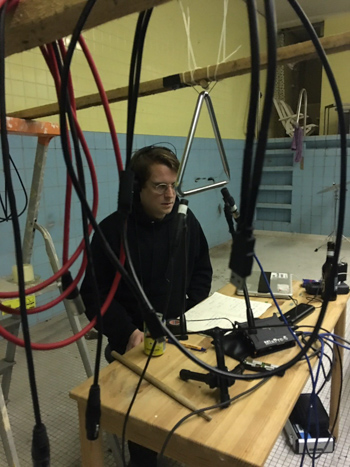

All sounds recorded stereo in a dry swimming pool. The triangle sounds are mixed with sine waves.
The spatialisation, situated as triangles, fosters the beating.
3 x 3 Speakers routed to
Triangles A/B, D/E, G/H
Sine to C, F, I

Originally this peace is 60 minutes.

This is a short version for a concert in Echoraum, Vienna.
(8:00) [Multichannel]

